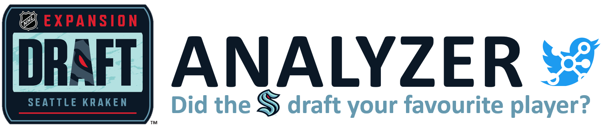

# NHL Expansion Draft Analyzer
> Streamlit app that visualizes sentiment from NHL fans and insiders on Twitter.

## Table of contents
---
* [Introduction](#introduction)
* [Methodology](#methodology)
* [App overview](#app-overview)
* [Setup](#setup)
* [How to use the app](#how-to-use-the-app)
* [Future releases](#future-releases)
* [Resources](#resources)
* [Developer contact](#developer-contact)

## Introduction
---
 
### Purpose

The ~~glorious~~ purpose of this project is to **estimate sentiment** from NHL fans and insiders on Twitter during the Seattle Kraken's 2021 **NHL Expansion Draft**.

### Brief

On July 21, 2021, the NHL will welcome the Seattle Kraken as the 32nd franchise in the league's history. The much-anticipated expansion to the league requires the Kraken to select players from incumbent NHL teams around the league in what's appropriately called an **Expansion Draft**. 

The player selection rules and guidelines are the same as the ones used back in 2017 when the Vegas Golden Knights entered the league. To learn more about the rules, [read this short article from the NHL](https://www.nhl.com/news/seattle-kraken-2021-nhl-expansion-draft-rules-same-as-vegas-golden-knights-followed/c-302586918).

This project is an attempt to understand how people around the NHL feel about the Expansion Draft, in real-time. Specifically, treating NHL fans and NHL insiders differently and applying text analysis to both in separate pages in the app.

### The Draft Analyzer (a Streamlit app)
Coming soon! We are working on putting a visual demo here, as well as a link to the application.

## Methodology
---

### Getting the data
Data is retrieved from the [Twitter API v2.0](https://developer.twitter.com/en/docs/twitter-api) using the [tweepy Python library](https://www.tweepy.org/) and ~~top secret~~ personal Twitter developer credentials. To differentiate between NHL fans and insiders, we chose to leverage two different end-points: Twitter Search (NHL fans), and Twitter Timeline (NHL insiders). We will go into more detail in the [app overview section](#app-overview)

### Text analytics
When we refer to text analytics, you can think of it as a set of different processes to create high-quality insight from tweet data. 

Below is a list of the different processes that were used:

* **Sentiment analysis and classification** to estimate both the general feeling of a tweet, as well as the extremity of that feeling concerning other tweets. We used a lexicon and rule-based sentiment analysis tool from the [vaderSentiment python library](https://github.com/cjhutto/vaderSentiment):
    * [VADER](https://github.com/cjhutto/vaderSentiment#vader-sentiment-analysis) (**V**alence **A**ware **D**ictionary and s**E**ntiment **R**easoner) = lexicon and rule-based sentiment analysis tool, specifically attuned to sentiments expressed in social media
    * [Compound score](https://github.com/cjhutto/vaderSentiment#about-the-scoring) = computed by summing the valence scores of each word in the lexicon, adjusted according to the rules, and then normalized to be between -1 (most extreme negative) and +1 (most extreme positive)
    * Positive sentiment: compound score >= 0.05
    * Neutral sentiment: (compound score > -0.05) and (compound score < 0.05)
    * Negative sentiment: compound score <= -0.05

* **Topic modeling and Latent Dirichlet Allocation (LDA)** to attempt to understand the main themes apparent in the cluster of tweets. This was done primarily through the [gensim python library](https://pypi.org/project/gensim/)

* **Rule-based mixed-membership classification of text** to label each of the NHL teams mentioned in a tweet. That is, each tweet can belong to 0, 1, or multiple NHL teams. The rules used are imperfect keywords (if keywords exist, then label as related NHL team). We used a combination of data manipulation and visualization libraries such as `pandas`, `numpy` and `altair`. 

* **Word clouds and custom top-tweet logic** to get a quick overview of the top words seen on Twitter. We used the [worldcloud python library](https://pypi.org/project/wordcloud/) in addition to various data manipulation libraries to accomplish this.

* **Descriptive text analysis** to conduct n-gram and frequency analysis, in addition to building summary KPIs. We used the same data manipulation and visualization libraries stated above.

### Streamlit app

We used [Streamlit](https://streamlit.io/) to surface insights from the various analyses. 

What is Streamlit?

> Streamlit is the fasted way to build and share data apps. It turns Python scripts into shareable web apps.

In the following section, we will go into the nitty-gritty of our application.

## App overview
---

### App structure

The app uses [Streamlit v0.84](https://docs.streamlit.io/en/0.84.0/). At the time of deployment, it did not natively support multi-page apps. As a result, we turned to the wonderful world of stack-overflow and Streamlit community threads and found a methodology to treat individual python scripts as a page in a Streamlit app. For credit and resources, see the [resources section](#resources).

At a high level, the app structure behaved as described below:

1. `app_multipage.py` is set up to enable multiple pages to be run

2. Twitter developer credentials are stored in a local folder named `.streamlit`, ignored by our `.gitignore` file

3. Required inputs to the app such as `nhl_app_accounts.csv`, `nhl_app_teams.csv`, and the `nhl_app_logo.png` are stored in the folder `assets`

4. `fans.py`, `insiders.py`, and `readme.py` are created within a folder named `pages`. Each file is its own Streamlit application

5. `app.py` combines user input and the functions from `app_multipage.py` to display the app page that was selected by the user (e.g. default page is `readme.py`) 

As mentioned in the [future releases section](#future-releases), we are working on a process diagram to visualize the flow of data used in our app.

### Fan-analyzer
The goal of this page is to estimate how NHL fans around the league feel towards the NHL Expansion Draft. 

To do this, we used the Twitter Search API endpoint as it allows for flexible query search parameters. Every time this page runs, the `twitter_get_nhl` function is used to search for the most recent x many tweets having the keywords `expansion draft` or `expansiondraft`. Following this, various transformations are called to deliver text analytics insight and data visualizations.

### NHL insider analyzer
Similar to the Fan-analyzer page, the goal of this page is to estimate sentiment on Twitter. However, this page is all about analyzing the sentiment of professionals in the NHL, which we refer to as insiders. Really, it is ~~an arbitrary~~ just a custom list of hockey reporters and analytics folks who offer popular takes on Twitter. 

This required using the Twitter Timeline API endpoint, which provides all the tweets posted by a specified user. Our logic simply loops through the aforementioned list of accounts and returns all of the tweets posted within 48 hours. Following this, similar transformations are made to deliver text analytics insight and data visualizations.

## Setup
---
### Setting up
To run this app on your own, either `fork` this repository, or `git clone` into your local. 

### Requirements
See the [requirements.txt file](https://github.com/dmf95/nhl-expansion-twitter-app/blob/main/requirements.txt) for the libraries and version required to run this app.

### Getting data from Twitter
You will need to get your approval from Twitter to get data from their API. You can [apply for a Twitter developer account at this link](https://developer.twitter.com/en/apply-for-access).

There are various resources to help you with setting up your credentials - we found [this article](https://stackabuse.com/accessing-the-twitter-api-with-python) to be a good resource. 

**Important reminder on protecting your credentials:** If you plan on using git for version control, don't forget to add a `.gitignore` file with the proper configurations to ensure your credentials stay private!

## How to use the app
---
Coming soon! We are working on putting a visual demo here.

## Future releases
---
* Performance of the application and streamlit caching of results - TBA
* Miro board process diagram to visualize the flow of information - TBA
* Labeling of commits & versioning - TBA
* Refactoring and modularization of functions - TBA
* Test automation and CI/CD - TBA
          
## Resources
---
* https://ourcodingclub.github.io/tutorials/topic-modelling-python/
* https://www.dataquest.io/blog/tutorial-add-column-pandas-dataframe-based-on-if-else-condition/
* https://jackmckew.dev/sentiment-analysis-text-cleaning-in-python-with-vader.html
* https://discuss.streamlit.io/t/how-to-download-file-in-streamlit/1806
* https://stackabuse.com/accessing-the-twitter-api-with-python

## Developer contact
---
* [Domenic Fayad](https://www.fullstaxx.com/)
* [Shannon Lo](https://shannonhlo.github.io/)

