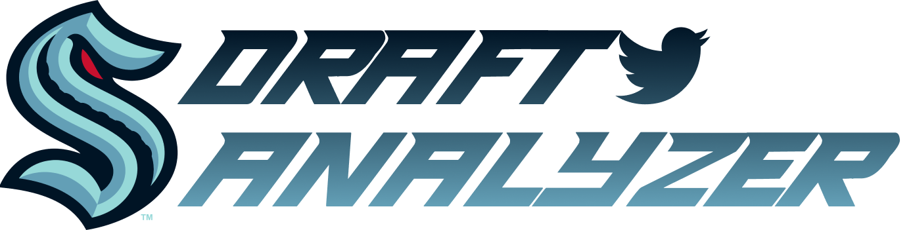

# NHL Expansion Draft Analyzer
> Streamlit app that hits the Twitter API and summarizes tweet sentiment from NHL fans and insiders.

## Table of contents
* [Glorious Purpose](#glorious-purpose)
* [How To](#how-to)
* [Technologies](#technologies)
* [Setup](#setup)
* [In Progress](#in-progress)

## Glorious Purpose
The purpose of this project is to **explore Twitter sentiment** during the Seattle Kraken's 2022 **NHL Expansion Draft**.

## How To
The purpose of this project is to **explore Twitter sentiment** during the Seattle Kraken's 2022 **NHL Expansion Draft**.
            
## Technologies
Project is created with:
* Lorem version: 12.3
* Ipsum version: 2.33
* Ament library version: 999
            
## Setup
To run this project, install it locally using npm:

```
$ cd ../lorem
$ npm install
$ npm start
```

## In Progress
To run this project, install it locally using npm:

```
$ cd ../lorem
$ npm install
$ npm start
```
